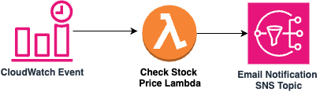

# StockAlert
StockAlert is a Python AWS CDK project that uses AWS services to monitor stock prices and send notifications when a stock crosses a predefined threshold. It leverages AWS CloudWatch Events to trigger AWS Lambda functions, which check stock prices and invoke Amazon SNS to send alerts.

## Architecture
The architecture of the application is as follows:

